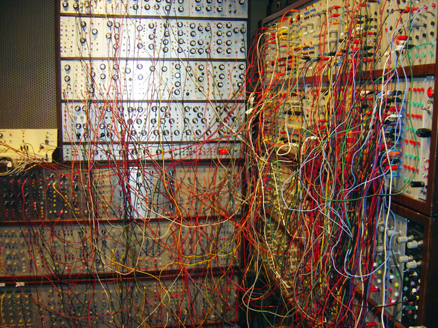
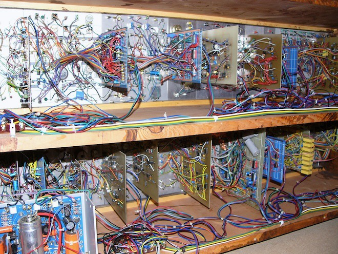
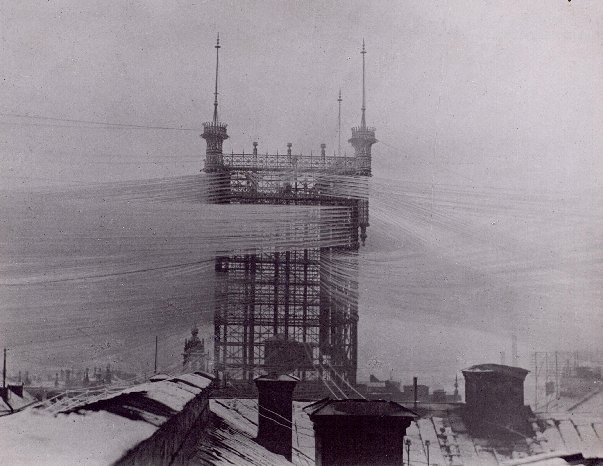
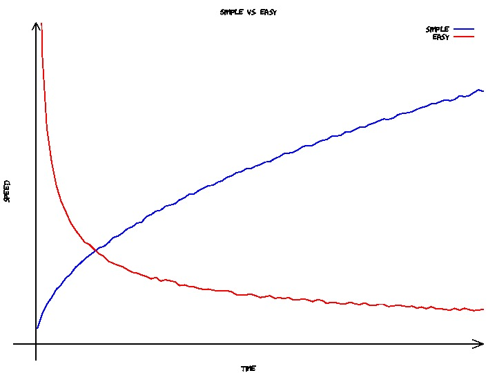
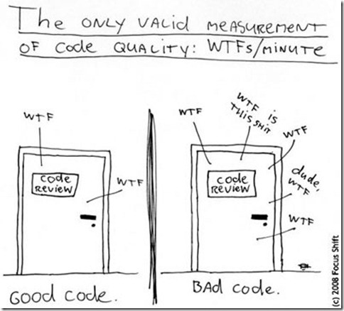

.. role:: cover

============================================
:cover:`Complexity in software development`
============================================

.. class:: cover

    ::

        Jonas Juselius <jonas.juselius@uit.no>
        HPC@UiT

.. raw:: pdf

   SetPageCounter 0
   Transition Dissolve 1
   PageBreak oneColumn

The tar pit
----------------------------------------------------
* Over time software tends to become harder and harder to reason about
* The code base easily becomes untidy ("I'll fix it later")
* Small changes become harder to implement
* Hacks and workarounds trump design
* Bugs start appearing where in unexpected places
* More time is spent debugging than developing
* Complexity strangles development

Causes of complexity
----------------------------------------------------
* Our tools and languages
* Poor design or wrong design
* Not enough resources (e.g. time)

The dark side
---------------------------------------------------

The brain facing computer code
----------------------------------------------------
.. image:: img/Homer-simpson-brain.jpg
    :scale: 150%

Inherent vs. incidental complexity
----------------------------------------------------
We distinguish between two types of complexity:

* *Inherent* complexity of the problems space
* *Incidental* complexity in the solution space
* Complexity implies braiding and intertwining
* Simplicity implies "one foldedness", i.e. one braid, single entity

.. image:: img/tincan.png
    :scale: 45%

Stockholm telephone tower anno 1910
----------------------------------------------------

Simple vs. easy
----------------------------------------------------
* Simple is not the same as easy
* Simple means:
    * One role or tasks
    * One concept or dimension
* Easy means:
    * Familiarity
    * Near at hand
* Just because you know it does not make it simple

Development speed
----------------------------------------------------

Simplicity
----------------------------------------------------
* Simplicity is the prerequisite of reliability (E. Dijkstra)
* We can only consider a very limited number of things at once
* Complex things must be considered together, undermining understanding
* We can only hope to make reliable things we understand

Benefits of simplicity
----------------------------------------------------
* Easy to understand
* Easy to change
* Easy to debug
* Simplicity is much harder than complexity!

*"Simplicity is the ultimate sophistication. L. da Vinci."*

Enemy of the state
----------------------------------------------------
* The no. 1 cause of complexity is *state*, i.e. variables
* Every mutable variable is stateful
* For every bit of state in your program, there are two tests: A program with
  100 integer variables has :math:`2^{3200}` distinct states.

Local variables are stateful too
----------------------------------------------------
.. math::

    f(x) = (n+1)(n+2)

.. code-block:: Python

    def f(x):
        x = x + 1
        y = x + 1
        return x * y

.. math::

    f(x) = (n+1)^2

.. code-block:: Python

    def f(x):
        y = x + 1
        x = x + 1
        return x * y

Referential transparency
----------------------------------------------------

.. code-block:: Python

    def f(x):
        x1 = x + 1
        y1 = x1 + 1
        return x1 * y1

Haskell example:

.. code-block:: Haskell

    f :: (Num a) => a -> a
    f x = x' * y'
        where
            y' = x' + 1
            x' = x + 1

Me, preparing to mutate some state
---------------------------------------------------

State of affairs
----------------------------------------------------
* Information vs. place
* PLOP: New information replaces old
* Facts don't change because we ignore them
* PLOP grew out of tiny computer memories
* Information is simple, don't ruin it
* We use values on the wire, why not in our codes?

The value of values
----------------------------------------------------
* Values are immutable
* Values can be shared
* Values are easy to fabricate
* Values are language agnostic
* Values aggregate. Objects don't (usually)
* Values are stable: reproducible results
* Values don't *need* methods
* Values have representation, *not* implementation

Concurrency
---------------------------------------------------
* Concurrency in imperative code is very hard
* You are totally lost in the dark without a good thread checker
* In a pure, immutable world concurrency is nearly trivial!

Composition
----------------------------------------------------
* Composition enables us to build complex behavior from simple components
* We can reason about the components, and we can reason about the composite
* Composition is key to managing complexity
* Modularity does not imply simplicity, but is enabled by it

The litmus test
----------------------------------------------------
* Can you move sub-systems?
    * To another language?
    * To another machine?
    * Without changing much?

.. image:: img/under_the_hood.png
    :scale: 200%

How about object-oriented programming?
----------------------------------------------------
* Encapsulation: Adding implementation to information?
* Complects both state and information
* OOP lures us to implement with little, moving machines

| The problem with object-oriented languages is they’ve got all this implicit environment
| that they carry around with them. You wanted a banana but what you got was a gorilla
| holding the banana and the entire jungle.
|
|  Joe Armstrong

A base class
----------------------------------------------------
.. code-block:: Python

    class A(object):
        def __init__(self):
            self.a = 1

        def addone(self, x):
            self.a += 1
            return x + self.a

        def inc(self, x):
            return x + self.a

Hidden state, crouching dragon
----------------------------------------------------
.. code-block:: Python

    class B(A):
        def __init__(self):
            super(B,self).__init__()

        def np1np2(self, x):
            a = self.addone(x)
            b = self.inc(x)
            return a * b

    b = B()
    print b.np1np2(5)

It started really simple
---------------------------------------------------
.. image:: img/complex-machine.jpg
    :scale: 18%

Code quality
------------------------------------------------------
Every bug has passed both the type checker and the test suite.

